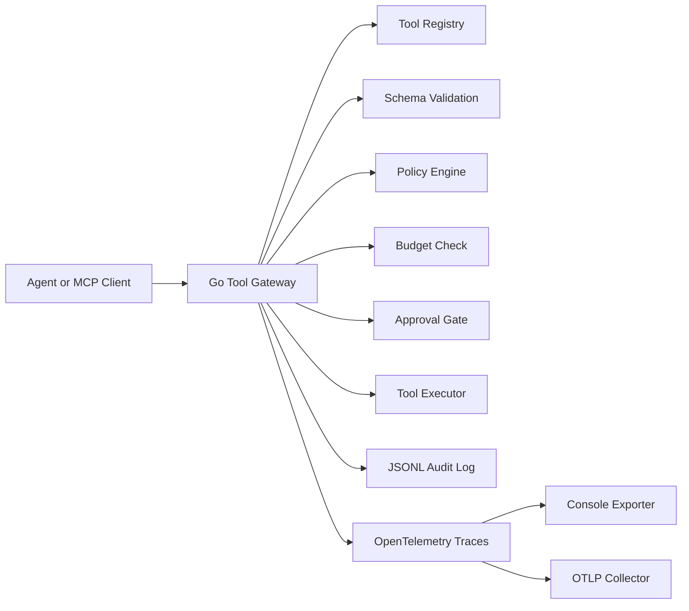

# mcp-observe-go

Go-based MCP-style tool gateway with policy checks, approval gates, JSONL audit logs, and OpenTelemetry-compatible traces for tool execution.

The project is built around a practical production question:

> When an AI agent invokes a tool through an MCP-style gateway, can we validate the request, apply policy, control risk, record an audit event, and trace each step of the tool call?

This repository focuses on AI infrastructure rather than model experimentation. It is intentionally backend-heavy and framework-light, using Go's standard HTTP server, structured tool definitions, policy evaluation, JSONL audit logging, and OpenTelemetry tracing.

---

## What This Demonstrates

- Go service design for AI tool-execution infrastructure
- MCP-style tool registry and capability discovery
- Tool-call request validation against explicit schemas
- Policy decisions: `allow`, `deny`, and `require_approval`
- Approval gates for destructive production actions
- Budget checks for tool execution units
- JSONL audit logging with argument redaction
- OpenTelemetry-compatible traces for MCP-style tool activity
- Console tracing for local demos
- Optional OTLP export to an OpenTelemetry Collector
- Replay CLI for reviewing recent audit events
- Go tests for schema validation, policy decisions, budgets, and HTTP behavior

---

## Repository Structure

```text
mcp-observe-go/
├── cmd/
│   ├── server/                  # HTTP gateway entrypoint
│   └── replay/                  # Audit-log replay CLI
├── internal/
│   ├── audit/                   # JSONL audit logger and reader
│   ├── budget/                  # Tool cost and budget checks
│   ├── config/                  # Environment-driven configuration
│   ├── contracts/               # Shared request/response contracts
│   ├── gateway/                 # HTTP handlers and tool-call orchestration
│   ├── observability/           # OpenTelemetry setup and exporters
│   ├── policy/                  # Allow / deny / approval policy engine
│   ├── schema/                  # Lightweight argument validation
│   ├── tools/                   # Tool registry and mock tool handlers
│   └── version/                 # Project version
├── examples/                    # Example tool-call payloads
├── docs/                        # Architecture and trace design docs
├── docker-compose.yml           # Optional OpenTelemetry Collector
├── otel-collector-config.yaml   # Local collector config
├── go.mod
├── go.sum
├── README.md
├── LICENSE
└── .gitignore
```

---

## Architecture



---

## Trace Model

A single tool call emits a trace like this:

```text
mcp.tool_call
├── mcp.validate_schema
├── mcp.policy_check
├── mcp.budget_check
├── mcp.approval_check
├── mcp.execute_tool
└── mcp.audit_write
```

Example trace attributes:

```text
mcp.session_id
mcp.client_name
mcp.tool.name
mcp.environment
mcp.arguments.count
mcp.arguments.hash
mcp.schema.valid
mcp.policy.decision
mcp.tool.risk_level
mcp.budget.allowed
mcp.approval.required
mcp.tool.executed
mcp.audit_id
```

The project uses MCP-oriented custom trace attributes. It does not claim these are official MCP semantic conventions.

---

## Local Setup

### Prerequisites

Install:

- Go 1.24+
- curl
- Docker Desktop, optional, only for the OpenTelemetry Collector demo

Verify Go:

```bash
go version
```

---

## Run the Gateway

From the repository root:

```bash
go mod tidy
go test ./...
go run ./cmd/server
```

The gateway starts at:

```text
http://localhost:8080
```

Health check:

```bash
curl http://localhost:8080/health
```

Expected response:

```json
{"service":"mcp-observe-go","status":"ok","version":"0.1.0"}
```

---

## List Tools

```bash
curl http://localhost:8080/tools
```

The default tool registry includes:

| Tool                | Risk   | Purpose                                                  |
| ------------------- | ------ | -------------------------------------------------------- |
| `search_docs`       | Low    | Search internal documentation snippets                   |
| `create_ticket`     | Medium | Create a support ticket                                  |
| `send_notification` | Medium | Queue a notification                                     |
| `delete_record`     | High   | Mock destructive action requiring approval in production |

---

## MCP-Style Capabilities

```bash
curl http://localhost:8080/mcp/capabilities
```

This endpoint exposes a compact MCP-style capability view for the gateway and registered tools.

---

## Execute a Low-Risk Tool

```bash
curl -X POST http://localhost:8080/tool-call \
  -H "Content-Type: application/json" \
  -d @examples/search_docs.json
```

Expected behavior:

```text
Decision: allow
Risk: low
Executed: true
Trace: emitted through the configured OpenTelemetry exporter
Audit: written to audit/tool_calls.jsonl
```

---

## Execute Medium-Risk Tools

Create ticket:

```bash
curl -X POST http://localhost:8080/tool-call \
  -H "Content-Type: application/json" \
  -d @examples/create_ticket.json
```

Send notification:

```bash
curl -X POST http://localhost:8080/tool-call \
  -H "Content-Type: application/json" \
  -d @examples/send_notification.json
```

Expected behavior:

```text
Decision: allow
Risk: medium
Executed: true
Trace: emitted through the configured OpenTelemetry exporter
Audit: written to audit/tool_calls.jsonl
```

---

## Execute a High-Risk Tool Without Approval

```bash
curl -X POST http://localhost:8080/tool-call \
  -H "Content-Type: application/json" \
  -d @examples/delete_record_requires_approval.json
```

Expected behavior:

```text
Decision: require_approval
Risk: high
Executed: false
Reason: delete_record is destructive in production and requires approval
```

This demonstrates that the gateway does not blindly execute destructive production tool calls.

---

## Execute a High-Risk Tool With Demo Approval

```bash
curl -X POST http://localhost:8080/tool-call \
  -H "Content-Type: application/json" \
  -d @examples/delete_record_approved.json
```

Expected behavior:

```text
Decision: allow
Risk: high
Executed: true
Tool result: mock delete is scheduled, no real data is deleted
```

The approval token is only a demo mechanism for showing the control flow.

---

## Replay Audit Logs

After running tool calls:

```bash
go run ./cmd/replay -limit 10
```

Example output:

```text
2026-08-11 18:39:38 | allow | low | search_docs | executed=true | trace=... | audit=...
2026-08-11 18:41:40 | require_approval | high | delete_record | executed=false | trace=... | audit=...
2026-08-11 18:43:25 | allow | high | delete_record | executed=true | trace=... | audit=...
```

The replay command prints recent audit records with decision, risk level, tool name, execution status, trace ID, and audit ID.

---

## OpenTelemetry Collector Demo

By default, traces are printed to stdout. To export traces through OTLP, start the local OpenTelemetry Collector:

```bash
docker compose up -d
```

Confirm the collector is running:

```bash
docker compose ps
```

Run the gateway with OTLP enabled:

```bash
MCP_OBSERVE_OTEL_EXPORTER=otlp \
MCP_OBSERVE_OTLP_ENDPOINT=127.0.0.1:4317 \
go run ./cmd/server
```

Then execute a tool call:

```bash
curl -X POST http://localhost:8080/tool-call \
  -H "Content-Type: application/json" \
  -d @examples/search_docs.json
```

Check collector logs:

```bash
docker compose logs -f otel-collector
```

The collector should show spans such as:

```text
mcp.tool_call
mcp.validate_schema
mcp.policy_check
mcp.budget_check
mcp.approval_check
mcp.execute_tool
mcp.audit_write
```

It should also show MCP-oriented attributes such as:

```text
mcp.tool.name
mcp.policy.decision
mcp.tool.risk_level
mcp.approval.required
mcp.tool.executed
mcp.arguments.hash
mcp.audit_id
```

To verify high-risk approval behavior in collector logs:

```bash
curl -X POST http://localhost:8080/tool-call \
  -H "Content-Type: application/json" \
  -d @examples/delete_record_requires_approval.json
```

Then inspect the collector output:

```bash
docker compose logs --tail=300 otel-collector | grep -E "mcp\.|delete_record|require_approval|high"
```

Stop the collector:

```bash
docker compose down
```

---

## Configuration

| Variable                    | Default                  | Purpose                    |
| --------------------------- | ------------------------ | -------------------------- |
| `MCP_OBSERVE_ADDR`          | `:8080`                  | HTTP server address        |
| `MCP_OBSERVE_AUDIT_PATH`    | `audit/tool_calls.jsonl` | JSONL audit output path    |
| `OTEL_SERVICE_NAME`         | `mcp-observe-go`         | OpenTelemetry service name |
| `MCP_OBSERVE_OTEL_EXPORTER` | `stdout`                 | `stdout` or `otlp`         |
| `MCP_OBSERVE_OTLP_ENDPOINT` | `127.0.0.1:4317`         | OTLP gRPC endpoint         |

---

## Security Notes

This project is designed for local development and portfolio review.

- Do not expose the gateway directly to the public internet without authentication, authorization, rate limiting, TLS, and tenant isolation.
- The `/audit` endpoint is intended for local demo use only. In a production deployment, audit access should require authentication and authorization.
- Do not put secrets, API keys, tokens, raw prompts, or sensitive customer data into trace attributes.
- Tool arguments are hashed for trace attributes and redacted in audit logs when sensitive key names are used.
- `delete_record` is a mock tool and does not delete real data.
- Approval uses a demo token only to demonstrate the control flow. It is not production authentication.

Recommended production hardening would include:

- Real authentication and authorization
- Signed approval workflow
- Secret redaction policies
- Per-tenant budgets and rate limits
- Persistent policy configuration
- mTLS or authenticated OTLP export
- Structured log shipping
- Formal MCP server/client integration

---

## Development Commands

Format and test:

```bash
go fmt ./...
go test ./...
```

Run the server:

```bash
go run ./cmd/server
```

Replay recent audit events:

```bash
go run ./cmd/replay -limit 10
```

Build binaries:

```bash
go build -o bin/mcp-observe-go ./cmd/server
go build -o bin/mcp-observe-replay ./cmd/replay
```

---

## Design Notes

- The gateway is intentionally MCP-style in v1 rather than a full official MCP SDK server.
- Tool arguments are not written directly into trace attributes.
- Trace attributes use counts, hashes, decisions, and risk labels to preserve observability without exposing sensitive payloads.
- The local approval token is only a demonstration mechanism.
- OpenTelemetry traces are exported either to stdout or to a local OTLP collector.
- Runtime audit logs are local JSONL files and are intentionally excluded from version control.

---

## Roadmap

- Add official MCP SDK server transport
- Add configurable policy files
- Add signed approval records
- Add OpenTelemetry metrics for decision counts and latency
- Add Prometheus-style local metrics endpoint
- Add Jaeger/Tempo demo configuration
- Add GitHub Actions CI
- Add Dockerfile for the gateway

---

## License

This project is licensed under the MIT License. See LICENSE.